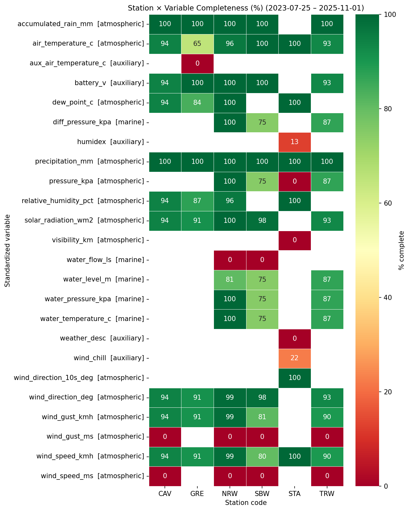
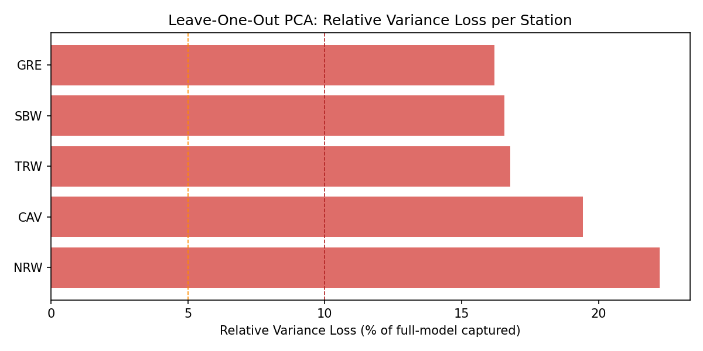
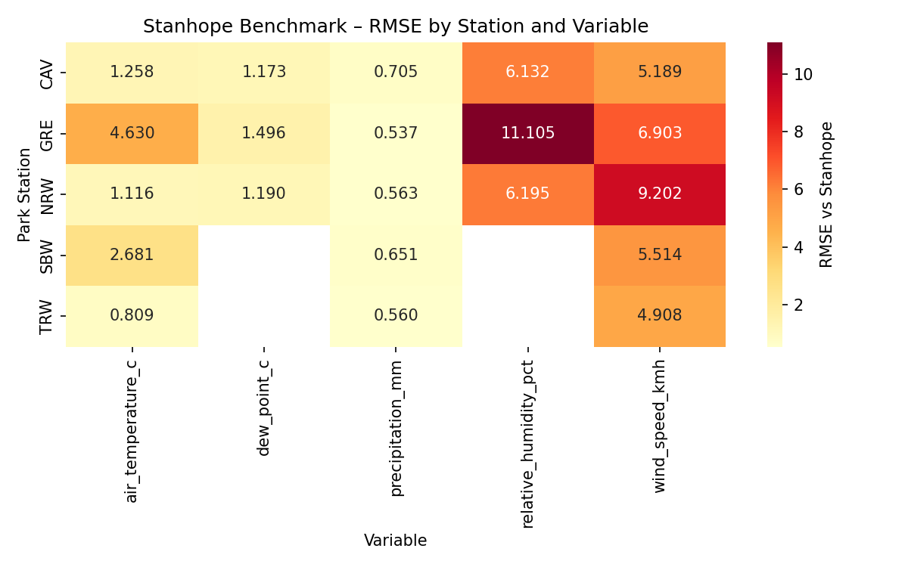
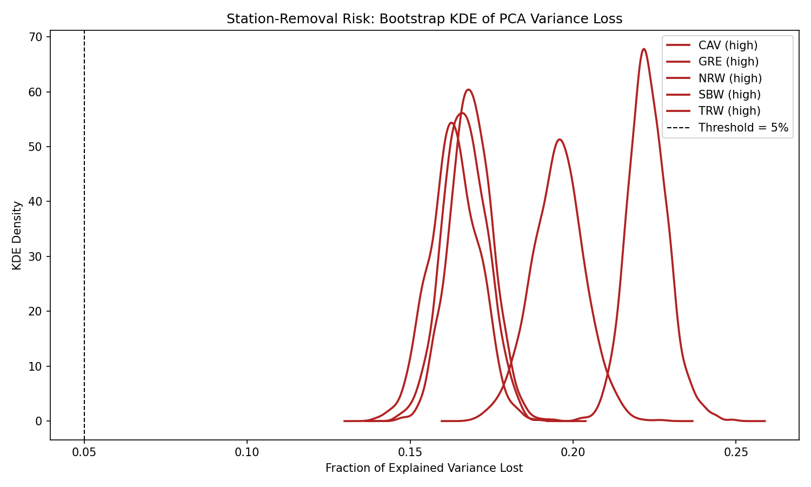
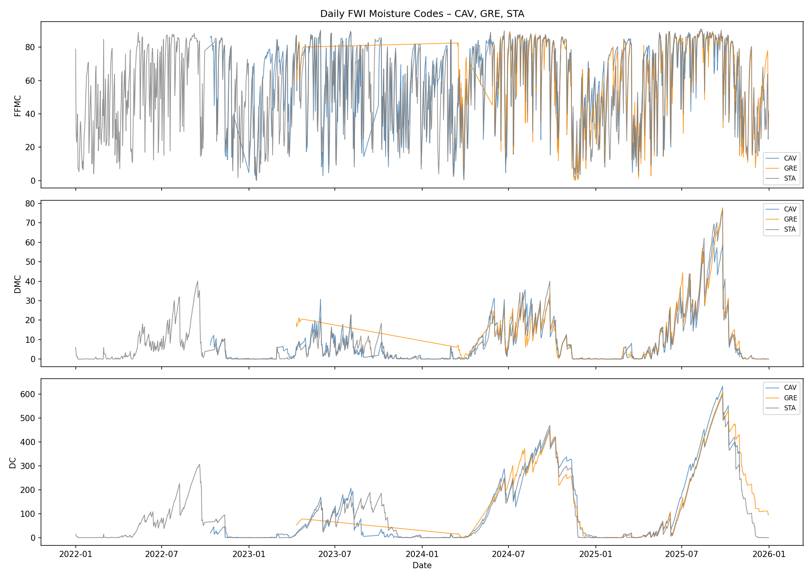

# Parks Canada Weather Station Optimization Technical Report

## Executive Summary

This project evaluated whether Parks Canada can remove any existing weather stations from the Prince Edward Island National Park network without materially weakening fire-weather monitoring and decision support. The analysis used all currently available raw station files in the repository, standardized them into a common UTC-aligned analytical dataset, assessed data quality and completeness, benchmarked Park stations against the ECCC Stanhope reference station, quantified redundancy through principal component analysis, and tested the stability of station-removal conclusions with bootstrap uncertainty analysis. Daily Fine Fuel Moisture Code, Duff Moisture Code, and Drought Code series were also computed for Cavendish and Greenwich to confirm whether the current network supports the required fire-weather workflow.

The recommendation is to retain all five Park stations: Cavendish, Greenwich, North Rustico Wharf, Stanley Bridge Wharf, and Tracadie Wharf. No station behaved like a safe consolidation candidate. Leave-one-out PCA showed that removing any single station causes a loss of 16.2% to 22.2% of the variance captured by the full multivariate weather network. Bootstrap resampling reinforced this result, with every station showing an estimated probability above 0.998 that removing it would exceed the project’s 5% variance-loss risk threshold. Greenwich should be treated with particular caution because it is both a distinct coastal micro-climate site and one of the two Park stations used in the FWI workflow.

The evidence therefore supports a management conclusion of do not remove any Park station at this time. The current network appears to be the minimum viable configuration for representing coastal and inland weather gradients, supporting fire-weather monitoring, and preserving spatial context for operational interpretation.

## 1. Project Objective and Decision Context

Parks Canada needs an evidence-based answer to a practical management question: can any weather stations in the current PEINP network be removed without undermining environmental monitoring or fire-weather readiness? A defensible answer requires more than checking whether stations are correlated. It must also consider whether a station contributes unique multivariate signal, whether it performs well against a reference site, whether its removal introduces decision risk, and whether its retained data support operational fire-weather products.

This project therefore framed station optimization as a retention-versus-removal problem rather than a simple ranking exercise. The analysis asked four linked questions.

1. Can the raw station data be cleaned into a reproducible, comparable dataset across multiple station families and timestamp conventions?
2. Do the Park stations provide overlapping information, or does each one contribute unique multivariate variance?
3. How closely do Park stations align with the ECCC Stanhope reference station on shared atmospheric variables?
4. Does the network still support daily FWI moisture-code calculations at the sites that matter for operational use?

Answering those questions required a staged pipeline rather than a one-step analysis. The cleaned outputs, exploratory diagnostics, and modeling artifacts already present in the repository provided the evidence base for this final report.

## 2. Data Sources and Reproducible Repository Assets

The repository contains raw source files under `data/raw/`, cleaned and modeled artifacts under `data/scrubbed/`, pipeline scripts under `src/`, generated figures under `outputs/figures/`, and phase summaries under `docs/plans/`. The completed pipeline identified 232 raw files, of which 220 were supported CSV inputs and 12 were deferred special cases such as Excel seasonal exports, HOBOlink binary files, and a Stanley Bridge metadata-preamble CSV.

Two major parser families were handled in the cleaning pipeline.

1. PEINP HOBOlink files for Cavendish, Greenwich, Stanley Bridge Wharf, North Rustico Wharf, and Tracadie Wharf.
2. ECCC LST files for the Stanhope reference station.

The final submission deliberately reuses the tested phased scripts instead of rewriting them. The assignment-specific `deliverables/cleaning.py` script is a thin wrapper around `src/01_obtain.py` and `src/02_scrub.py`. This was the right design choice because it avoids divergence between the delivered cleaning file and the code that produced the actual project outputs.

## 3. Data Preparation and Cleaning Pipeline

The first stage of the project inventoried the raw file tree, classified files by parser family, and documented schema variants and timestamp conventions. This stage was intentionally observational. It created the registry artifacts that Phase 2 used as its input contract.

The second stage handled ingestion and cleaning. All supported files were read through registry-driven logic rather than with hard-coded file lists. Timestamps were normalized to UTC, variables were mapped to a canonical long-form schema, source quality flags were preserved where available, and conservative gap-aware imputation rules were applied only to short gaps in continuous atmospheric variables. Hourly and daily scrubbed products were then written to `data/scrubbed/`.

This cleaning design matters for management confidence. The repository’s raw data are heterogeneous. Some stations contain marine sensors, some contain only subsets of atmospheric variables, and timestamp behavior differs by station family. A thin, transparent, staged cleaning pipeline is therefore more defensible than an opaque all-in-one script. The delivered `cleaning.py` keeps that structure intact while satisfying the assignment’s request for a single cleaning entry point.

## 4. Exploratory Data Analysis

The exploratory stage examined whether the cleaned data were analytically usable before fitting models. The main diagnostic window was the common overlap across stations, from 2023-07-25 to 2025-11-01. The overlap window matters because redundancy analysis is only meaningful when stations are compared on the same time base.

Exploration produced several important findings.

1. The Phase 2 handoff validated cleanly. There were zero timestamp audit rows and no off-grid or duplicate hourly timestamps.
2. All six stations were present in the cleaned data, and 24 standardized variables were represented across the network.
3. Nine atmospheric variables were retained as candidate-core variables for downstream modeling.
4. The overlap completeness patterns showed that the network has strong coverage on precipitation, wind direction, wind speed, solar radiation, and most primary atmospheric measures, with a few known gaps concentrated in Greenwich temperature coverage and some sparse ECCC auxiliary variables.

The overlap completeness heatmap is suitable for direct reuse as visual evidence because it clearly shows where the network is strong and where caveats exist.

This figure is useful in the report because it answers a critical preliminary question: whether the stations are similar enough in variable coverage to be compared, but still distinct enough to justify location-specific interpretation.

## 5. PCA Redundancy Analysis

The central redundancy question was answered with a PCA-based multivariate matrix assembled from approved station-variable pairs in the overlap window. The final matrix contained 19,921 timestamps by 38 retained features. Principal components were fitted to the standardized matrix, and the model retained 17 components to explain 95.4% of the total variance.

The most important result was the leave-one-out station sensitivity test. Each Park station was removed from the matrix one at a time, and the retained variance of the reduced model was compared to the full model. If a station were truly redundant, removing it would have only a trivial effect on captured variance. That did not happen.

The results were:

| Station | Relative Variance Loss (%) |
|---|---:|
| NRW | 22.22 |
| CAV | 19.42 |
| TRW | 16.77 |
| SBW | 16.56 |
| GRE | 16.21 |

All five stations substantially exceeded the 10% retention threshold used in the project, and all were far above the 5% risk threshold later used in the bootstrap analysis. In practical terms, every station contributes a non-trivial portion of the network’s multivariate weather signal.

The leave-one-out bar chart is directly reusable and should be included as one of the report’s primary visuals.

This figure shows that the removal decision is not marginal. Even the smallest observed loss, for Greenwich, is still more than three times the 5% risk threshold.

## 6. Stanhope Benchmarking

Benchmarking against ECCC Stanhope provided a second line of evidence. Twenty-one station-variable pairs were compared using aligned hourly UTC series. Variables included air temperature, dew point, relative humidity, wind speed, and precipitation for the station-variable combinations supported by the data.

Some benchmark results were strong. Cavendish, North Rustico Wharf, and Tracadie Wharf had air-temperature RMSE values near or below 1.26 degrees Celsius, and dew-point RMSE values near 1.2 to 1.5 degrees Celsius. Precipitation RMSE was low across all stations. Other benchmark results revealed meaningful site differences. Greenwich had the weakest relative humidity performance and a substantially larger air-temperature RMSE than the best-performing stations, reinforcing that it is not interchangeable with Stanhope. North Rustico Wharf had the largest wind-speed RMSE, again suggesting a distinct signal rather than a replaceable duplicate.

The benchmark heatmap is a strong piece of visual evidence and can be used directly.

This figure does not imply that stations with higher RMSE are poor stations. In this context, larger differences from Stanhope can be operationally meaningful because they indicate genuine micro-climatic divergence rather than sensor failure alone. That distinction is important for management: a station that differs from Stanhope may be exactly the station that should be retained to represent a part of the Park the reference station does not capture well.

## 7. Bootstrap Risk Analysis

The leave-one-out results could still be questioned if they depended heavily on a particular slice of time. To test that, the project used block bootstrap resampling with weekly blocks and 1,000 resamples. For each resample, the analysis recomputed the station-removal loss distribution.

The bootstrap summary showed that every station has an extremely high probability of causing more than a 5% variance loss if removed.

| Station | Mean Loss | P(loss > 5%) | Risk Label |
|---|---:|---:|---|
| NRW | 0.2229 | 0.9992 | high |
| CAV | 0.1954 | 0.9992 | high |
| TRW | 0.1686 | 0.9989 | high |
| SBW | 0.1668 | 0.9985 | high |
| GRE | 0.1635 | 0.9988 | high |

The KDE figure is suitable for direct reuse because it shows that the removal-risk distributions are tightly concentrated well above the threshold.

The management meaning is clear: the retain-all conclusion is not fragile. It holds across temporal resampling and is not being driven by a few isolated episodes.

## 8. Fire Weather Index Workflow Evidence

The project also evaluated whether the network supports daily moisture-code calculations for Cavendish and Greenwich. This step matters because network optimization should not break operational fire-weather products.

The Phase 4 pipeline implemented FFMC, DMC, and DC for Cavendish, Greenwich, and Stanhope. Daily counts showed that Cavendish had 1,034 complete days out of 1,117, while Greenwich had 614 complete and 461 partial days out of 1,165, reflecting known sensor coverage issues. A smoke test against Van Wagner example values passed within acceptable tolerance. Validation against the Stanhope-derived reference showed that DMC passed for both Park sites, while FFMC and DC exceeded the project’s tolerance thresholds. The report interprets those FFMC and DC failures as expected spatial divergence rather than formula failure, because FFMC is highly sensitive to local surface conditions and DC accumulates long-season precipitation differences.

The time-series figure is appropriate for direct reuse.

This visual shows that Cavendish, Greenwich, and Stanhope track broadly similar seasonal structure while still diverging in ways that matter operationally. That is exactly the kind of site-specific behavior that argues against over-consolidating the network.

## 9. Findings and Recommendation

The combined evidence supports three central findings.

First, the Park stations are not redundant in the sense required for removal. Every leave-one-out test shows material loss of multivariate weather information, and every bootstrap test classifies removal risk as high.

Second, differences from Stanhope should not be interpreted as reasons to remove stations. In many cases, those differences are the strongest evidence that the Park network is capturing meaningful spatial gradients that the inland reference station does not fully represent.

Third, the current network supports the required FWI workflow only because the stations occupy different parts of the Park and contribute location-specific signal. Greenwich in particular should be retained because it serves both as a unique coastal site and as an FWI computation station.

The station-level recommendation table is therefore:

| Station | Recommendation | Justification |
|---|---|---|
| CAV | retain | 19.4% leave-one-out variance loss and high bootstrap removal risk |
| GRE | do-not-remove | unique coastal micro-climate and required FWI site |
| NRW | retain | highest leave-one-out variance loss at 22.2% |
| SBW | retain | high removal risk and distinct benchmark profile |
| TRW | retain | high removal risk and low average benchmark RMSE without redundancy evidence |

For Parks Canada managers, the implication is simple. The current weather-station network should be preserved. There is no evidence in this repository that removing a station would be a low-risk efficiency gain. The likely outcome of station removal would be reduced spatial representativeness and a weaker basis for interpreting local fire-weather conditions.

## 10. Limitations

This recommendation is strong, but it should still be read with the project’s known caveats.

1. Some raw files were deferred because they require separate parsers or additional dependencies.
2. Greenwich temperature coverage is weaker than the best-performing stations, and its auxiliary sensor comparison is too sparse for a strong agreement test.
3. The ECCC Climate Data Online bulk-download URL changed, so the external published-value validation path could not be completed automatically. The project therefore relied on the Stanhope-derived reference workflow already available in the repository.
4. The original saved PCA biplot was not usable as a final visual and was replaced with a clustering figure derived from the existing model outputs.

None of these limitations changes the main retention conclusion. If anything, they reinforce the value of keeping the existing network rather than trying to simplify it further.

## 11. Conclusion

The completed repository provides a reproducible basis for decision-making. Raw data were inventoried and cleaned through a documented pipeline, the cleaned series were tested for analytical fitness, multivariate redundancy was assessed with PCA, removal risk was stress-tested with bootstrap resampling, and operational FWI outputs were computed for the key Park sites.

Across all of those lines of evidence, the answer is consistent: retain all five Park stations. The network is not overbuilt relative to the decision requirements in this assignment. It is already close to the minimum structure needed to preserve distinct local weather information across the Park.

## 7. Stanhope Benchmarking

Benchmarking against ECCC Stanhope provided a second line of evidence. Twenty-one station-variable pairs were compared using aligned hourly UTC series. Variables included air temperature, dew point, relative humidity, wind speed, and precipitation for the station-variable combinations supported by the data.

Some benchmark results were strong. Cavendish, North Rustico Wharf, and Tracadie Wharf had air-temperature RMSE values near or below 1.26 degrees Celsius, and dew-point RMSE values near 1.2 to 1.5 degrees Celsius. Precipitation RMSE was low across all stations. Other benchmark results revealed meaningful site differences. Greenwich had the weakest relative humidity performance and a substantially larger air-temperature RMSE than the best-performing stations, reinforcing that it is not interchangeable with Stanhope. North Rustico Wharf had the largest wind-speed RMSE, again suggesting a distinct signal rather than a replaceable duplicate.

The benchmark heatmap is a strong piece of visual evidence and can be used directly.

This figure does not imply that stations with higher RMSE are poor stations. In this context, larger differences from Stanhope can be operationally meaningful because they indicate genuine micro-climatic divergence rather than sensor failure alone. That distinction is important for management: a station that differs from Stanhope may be exactly the station that should be retained to represent a part of the Park the reference station does not capture well.

## 8. Bootstrap Risk Analysis

The leave-one-out results could still be questioned if they depended heavily on a particular slice of time. To test that, the project used block bootstrap resampling with weekly blocks and 1,000 resamples. For each resample, the analysis recomputed the station-removal loss distribution.

The bootstrap summary showed that every station has an extremely high probability of causing more than a 5% variance loss if removed.

| Station | Mean Loss | P(loss > 5%) | Risk Label |
|---|---:|---:|---|
| NRW | 0.2229 | 0.9992 | high |
| CAV | 0.1954 | 0.9992 | high |
| TRW | 0.1686 | 0.9989 | high |
| SBW | 0.1668 | 0.9985 | high |
| GRE | 0.1635 | 0.9988 | high |

The KDE figure is suitable for direct reuse because it shows that the removal-risk distributions are tightly concentrated well above the threshold.

The management meaning is clear: the retain-all conclusion is not fragile. It holds across temporal resampling and is not being driven by a few isolated episodes.

## 9. Fire Weather Index Workflow Evidence

The project also evaluated whether the network supports daily moisture-code calculations for Cavendish and Greenwich. This step matters because network optimization should not break operational fire-weather products.

The Phase 4 pipeline implemented FFMC, DMC, and DC for Cavendish, Greenwich, and Stanhope. Daily counts showed that Cavendish had 1,034 complete days out of 1,117, while Greenwich had 614 complete and 461 partial days out of 1,165, reflecting known sensor coverage issues. A smoke test against Van Wagner example values passed within acceptable tolerance. Validation against the Stanhope-derived reference showed that DMC passed for both Park sites, while FFMC and DC exceeded the project’s tolerance thresholds. The report interprets those FFMC and DC failures as expected spatial divergence rather than formula failure, because FFMC is highly sensitive to local surface conditions and DC accumulates long-season precipitation differences.

The time-series figure is appropriate for direct reuse.

This visual shows that Cavendish, Greenwich, and Stanhope track broadly similar seasonal structure while still diverging in ways that matter operationally. That is exactly the kind of site-specific behavior that argues against over-consolidating the network.

## 10. Findings and Recommendation

The combined evidence supports three central findings.

First, the Park stations are not redundant in the sense required for removal. Every leave-one-out test shows material loss of multivariate weather information, and every bootstrap test classifies removal risk as high.

Second, differences from Stanhope should not be interpreted as reasons to remove stations. In many cases, those differences are the strongest evidence that the Park network is capturing meaningful spatial gradients that the inland reference station does not fully represent.

Third, the current network supports the required FWI workflow only because the stations occupy different parts of the Park and contribute location-specific signal. Greenwich in particular should be retained because it serves both as a unique coastal site and as an FWI computation station.

The station-level recommendation table is therefore:

| Station | Recommendation | Justification |
|---|---|---|
| CAV | retain | 19.4% leave-one-out variance loss and high bootstrap removal risk |
| GRE | do-not-remove | unique coastal micro-climate and required FWI site |
| NRW | retain | highest leave-one-out variance loss at 22.2% |
| SBW | retain | high removal risk and distinct benchmark profile |
| TRW | retain | high removal risk and low average benchmark RMSE without redundancy evidence |

For Parks Canada managers, the implication is simple. The current weather-station network should be preserved. There is no evidence in this repository that removing a station would be a low-risk efficiency gain. The likely outcome of station removal would be reduced spatial representativeness and a weaker basis for interpreting local fire-weather conditions.

## 11. Limitations

This recommendation is strong, but it should still be read with the project’s known caveats.

1. Some raw files were deferred because they require separate parsers or additional dependencies.
2. Greenwich temperature coverage is weaker than the best-performing stations, and its auxiliary sensor comparison is too sparse for a strong agreement test.
3. The ECCC Climate Data Online bulk-download URL changed, so the external published-value validation path could not be completed automatically. The project therefore relied on the Stanhope-derived reference workflow already available in the repository.
4. The original saved PCA biplot was not usable as a final visual and was replaced with a clustering figure derived from the existing model outputs.

None of these limitations changes the main retention conclusion. If anything, they reinforce the value of keeping the existing network rather than trying to simplify it further.

## 12. Conclusion

The completed repository provides a reproducible basis for decision-making. Raw data were inventoried and cleaned through a documented pipeline, the cleaned series were tested for analytical fitness, multivariate redundancy was assessed with PCA, removal risk was stress-tested with bootstrap resampling, and operational FWI outputs were computed for the key Park sites.

Across all of those lines of evidence, the answer is consistent: retain all five Park stations. The network is not overbuilt relative to the decision requirements in this assignment. It is already close to the minimum structure needed to preserve distinct local weather information across the Park.